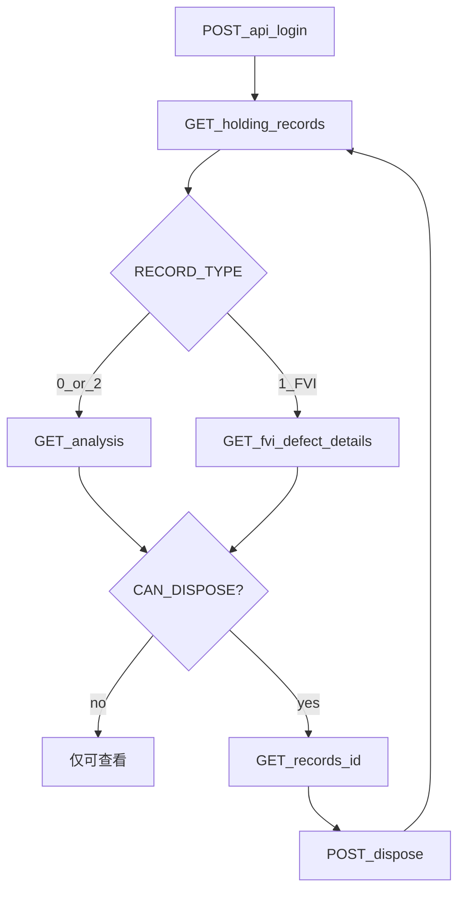

# 06 客户端集成流程

工程师客户端最小闭环：**登录 → 查 Holding → 分析 → 处置**；可选对接流转历史（`mine=1`）。

---

## 1. 端到端顺序

```text
1. 本地 MD5(明文密码) → POST /api/login（body.password 为 32 位 hex，勿传明文）
   └─ 校验 data.role === 1；若 data.must_change_password 为 true，打开 data.change_password_url 帮用户改密，不要进主界面
   └─ 保存 hold_session Cookie
   └─ GET /api/common_data/ftp/status：available=false 时提示会影响数据分析，不阻断进入
   └─ GET /api/common_data/software/latest_version：release 下本地版本落后则强制退出，去软件中心更新

2. GET /eng/api/holding_records?pending_only=1&page=1&page_size=20
   └─ 可选过滤：product_id / station / keyword / record_type
   └─ 展示 CAN_DISPOSE、RECORD_TYPE、HOLD_REASON 等

3. 用户选中一条记录做数据分析（可选但推荐）
   - RECORD_TYPE=0/2 → GET /admin/hold/api/analysis
       ?wafer_id={WAFER_ID}&lot_id={LOT_ID}
       &record_type={RECORD_TYPE}&station={推导值}
     station 推导（勿传 Holding 行原始 STATION）：
       RECORD_TYPE=0 且 LOT_ID 含 '-' → FATE-FA
       RECORD_TYPE=0 且 LOT_ID 不含 '-' → VBOX-FA
       RECORD_TYPE=2 → WLT2
     WAFER_ID 以 # 开头时 lot_id 必填
   - RECORD_TYPE=1（FVI）→ 不调 analysis，改调：
      GET /eng/api/fvi_defect_details?lot_id={LOT_ID}
   - HOLD_CODE 含 AQL_HOLD → 不调 analysis；桌面端用 `ANNEX_FTP_PATH` **直连附件 FTP** 取图（后端 `annex_image` / `annex_zip` 已下架）

4. 处置（仅 CAN_DISPOSE === true）
   a. GET /eng/api/records/{ID}
   b. GET /eng/api/notes?product_id={PRODUCT_ID}   （可选）
   c. 按 RECORD_TYPE 组装 body：
        0/1 → dispose + downgrades/retest_grades/...
        2   → wafer_actions（覆盖 WAFERS）
   d. POST /eng/api/dispose
   e. 成功后刷新列表（该单通常离开 pending）
```



---

## 2. 屏幕 / 模块建议

| 模块 | 依赖接口 | 要点 |
| --- | --- | --- |
| 登录 | `/api/login` | 密码先 MD5 再提交；非工程师账号拒绝进入主界面；`must_change_password` 时打开 `change_password_url` 改密；登录后探活 FTP；主界面 30 分钟无操作退出 |
| 待办列表 | `/eng/api/holding_records` | 默认 `pending_only=1`；提供「全部所属」开关时去掉该参数 |
| 分析面板 | `/admin/hold/api/analysis`（0/2）或 FVI 明细（1） | station 三值白名单；bysite 失败勿阻断处置按钮 |
| 处置表单 | `/eng/api/records` + `/eng/api/dispose` | 按 RECORD_TYPE 分支；提交前二次确认 |

---

## 3. 状态与按钮

| 条件 | UI |
| --- | --- |
| `CAN_DISPOSE === true` | 显示「处置」 |
| `CAN_DISPOSE === false` 且未关闭 | 可「分析」，提示非本人待办或已在生产节点 |
| `IS_CLOSED === true` | 禁止处置；可只读分析（若仍有数据） |

提交成功：`next_owner_id` 一般为 `181`；本地应从待办移除或标记已提交。

提交失败：展示服务端 `msg`；**不要**自动重试写操作（避免重复流转）。用户修正参数后可再次提交（若仍为负责人）。

---

## 4. RECORD_TYPE 分支检查清单

### FT / FVI（0 / 1）

- [ ] 选择单一 `dispose` ∈ {1,2,3,5}
- [ ] `2`：`downgrades` 至少一条真实变更
- [ ] `3`：`retest_grades` 非空
- [ ] 不传 `wafer_actions`

### WLT（2）

- [ ] 已加载 `WAFERS`
- [ ] 每个 wafer 一条 action，无遗漏无重复
- [ ] 降级带 `downgrade_mode`；夹具重测带合法 `retest_codes`
- [ ] 可选省略顶层 `dispose`，或与汇总一致

---

## 5. 错误处理约定

| HTTP / code | 客户端行为 |
| --- | --- |
| 401 | 清 Session，回登录页 |
| 403 | 提示无权限 / 非所属型号；刷新列表 |
| 400 | 展示 `msg`，停留表单 |
| 500 | 提示稍后重试；分析类可读失败可降级为空数据 |

---

## 6. 接口速查

| 步骤 | Method | Path |
| --- | --- | --- |
| 登录 | POST | `/api/login` |
| FTP 探活 | GET | `/api/common_data/ftp/status` |
| 型号（可选） | GET | `/eng/api/products` |
| Holding 列表 | GET | `/eng/api/holding_records` |
| 数据分析 | GET | `/admin/hold/api/analysis` |
| FVI 明细 | GET | `/eng/api/fvi_defect_details` |
| 处置加载 | GET | `/eng/api/records/<id>` |
| 备注下拉 | GET | `/eng/api/notes` |
| 行为目录 | GET | `/eng/api/dispose_actions` |
| 提交处置 | POST | `/eng/api/dispose` |
| 退出 | GET | `/logout` |

详细字段与示例见同目录其它文档。
